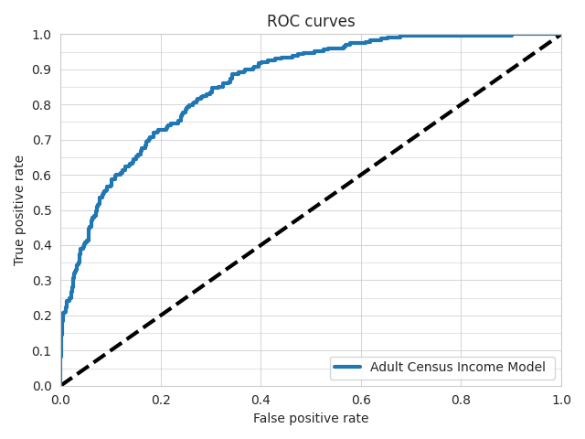
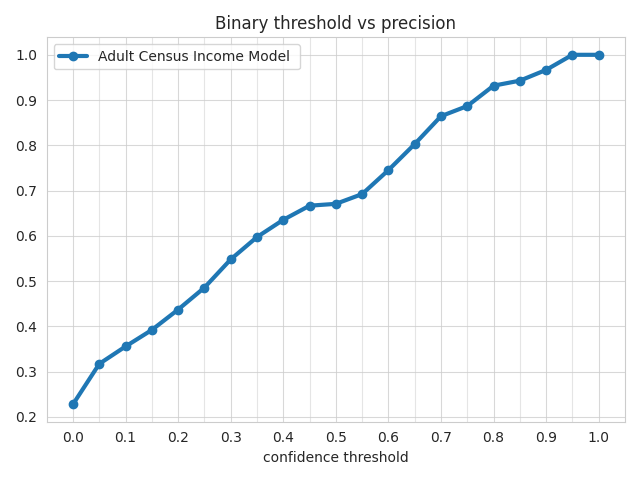
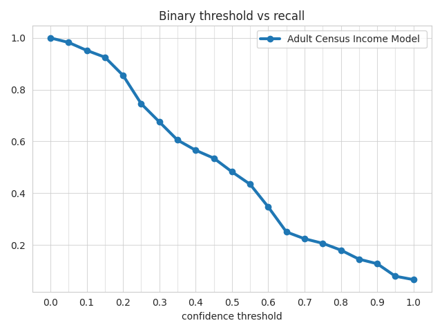
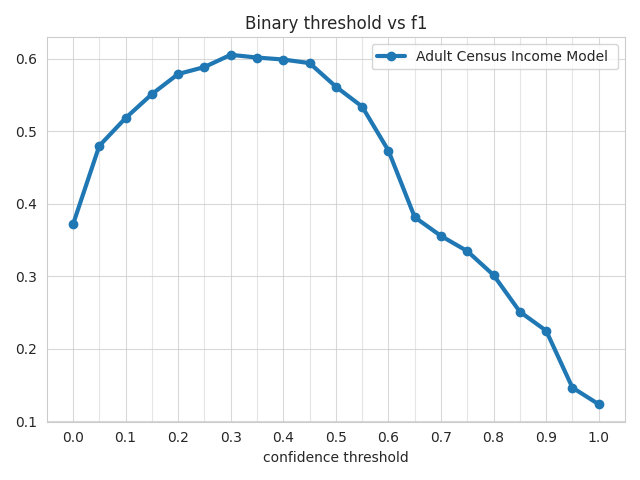

This is a complete example of training a model for binary classification.

These interactive notebooks follow the steps of this example:

- Ludwig CLI: [](https://colab.research.google.com/github/ludwig-ai/ludwig-docs/blob/master/docs/examples/adult_census_income_colab_notebooks/Adult_Census_Income_Classification_with_Ludwig_CLI.ipynb)
- Ludwig Python API: [](https://colab.research.google.com/github/ludwig-ai/ludwig-docs/blob/master/docs/examples/adult_census_income_colab_notebooks/Adult_Census_Income_Classification_with_Ludwig_API.ipynb)

## Download the Adult Census Income dataset

[Adult Census Income](https://archive.ics.uci.edu/ml/datasets/adult) is an extract of 1994 Census data for predicting whether a person's income exceeds $50K per year.  The data set consists of over 49K records with 14 attributes with missing data.

```shell
ludwig datasets download adult_census_income
```

This command will create a dataset `adult_census_income.csv` in the current directory.

The columns in the dataset are

| column         | description                                                  |
| -------------- | ------------------------------------------------------------ |
| age            | numeric variable, age of person                              |
| workclass      | categorical variable, Type of empolyment                     |
| fnlwgt         | numeric variable, no defintion                               |
| education      | categorical variable, education level                        |
| education-num  | nmeric variable, no definition                               |
| marital-status | categorical variable, marital status                         |
| occupation     | categorical variable, occupation                             |
| relationship   | categorical variable, Relationship to household              |
| race           | categorical variable, race                                   |
| sex            | categorical variable, gender                                 |
| capital-gain   | numeric variable, no definition                              |
| capital-loss   | numeric variable, no definition                              |
| hours-per-week | numeric variable, hours worked per week                      |
| native-country | categorical variable, Country of origin                      |
| income         | binary variable, " <=50K" or " >50K"                         |
| split          | numeric variable, indicating data split training(0), test(2) |

## Train

The Ludwig configuration file describes the machine learning task.  There is a vast array of options to control the learning process.  This example only covers a small fraction of the options.  Only the options used in this example are described.  Please refer to the [Configuration Section](../../configuration) for all the details.

First ['preprocessing' section](../../configuration/preprocessing) defines the gloabl preprocessing options.  All [numeric features](../../configuration/features/number_features) are z-scored normalized, i.e., mean centered and scaled by the standard deviation.  Numeric missing values are filled in with the mean of non-missing values.

The `input_features` section describes each of the predictor variables, i.e., the column name and type of input variable: [number](../../configuration/features/number_features) or [category](../../configuration/features/category_features/)

The 'combiner' section defines how the input features are combined to be passed to the output decoder.  This example uses the [`concat` combiner](configuration/combiner/#concat-combiner), which simply concatenates the output of the input feature encoders.  The combined data is passed through a three layer fully connected network of 128 cells in each layer with dropout regularization.

Next the `output_features` are defined.  In this example, there is one response variable called `income`.  This is a [binary feature](../../configuration/features/binary_features/) with two possible values: " <=50K" or " >50K".  Because thes values are not conventional binary values, i.e., "True" and "False", a feature specific preprocessing option is specified to indicate which string (" >50K") is interpreted as "True".  A four layer fully connected decoder of 32 cells in each layer is specified for this output feature.

The last section in this configuration file describes options for how the the [`trainer`](../../configuration/trainer/) will operate.  In this example the `trainer` will process the training data for 10 epochs.  The optimizer type is "adam".

=== "cli"

    ```yaml
    preprocessing:
      number:
        normalization: zscore
        missing_value_strategy: fill_with_mean

    input_features:
      - name: age
        type: number
      - name: workclass
        type: category
      - name: fnlwgt
        type: number
      - name: education
        type: category
      - name: education-num
        type: number
      - name: marital-status
        type: category
      - name: occupation
        type: category
      - name: relationship
        type: category
      - name: race
        type: category
      - name: sex
        type: category
      - name: capital-gain
        type: number
      - name: capital-loss
        type: number
      - name: hours-per-week
        type: number
      - name: native-country
        type: category

    combiner:
      type: concat
      num_fc_layers: 3
      output_size: 128
      dropout: 0.2

    output_features:
      - name: income
        type: binary
        preprocessing:
          fallback_true_label: " >50K"
        num_fc_layers: 4
        output_size: 32

    trainer:
      epochs:10
      optimizer:
        type: adam
    ```

=== "python"

    [LudwigModel](../../user_guide/api/LudwigModel/)

    ```python
    # create Ludwig configuration dictionary
    # define model configuration
    config = {'combiner': {'dropout': 0.2,
                  'num_fc_layers': 3,
                  'output_size': 128,
                  'type': 'concat'},
     'input_features': [{'name': 'age', 'type': 'number'},
                        {'name': 'workclass', 'type': 'category'},
                        {'name': 'fnlwgt', 'type': 'number'},
                        {'name': 'education', 'type': 'category'},
                        {'name': 'education-num', 'type': 'number'},
                        {'name': 'marital-status', 'type': 'category'},
                        {'name': 'occupation', 'type': 'category'},
                        {'name': 'relationship', 'type': 'category'},
                        {'name': 'race', 'type': 'category'},
                        {'name': 'sex', 'type': 'category'},
                        {'name': 'capital-gain', 'type': 'number'},
                        {'name': 'capital-loss', 'type': 'number'},
                        {'name': 'hours-per-week', 'type': 'number'},
                        {'name': 'native-country', 'type': 'category'}],
     'output_features': [{'name': 'income',
                          'num_fc_layers': 4,
                          'output_size': 32,
                          'preprocessing': {'fallback_true_label': ' >50K'},
                          'loss': {'type': 'binary_weighted_cross_entropy'},
                          'type': 'binary'}],
     'preprocessing': {'number': {'missing_value_strategy': 'fill_with_mean',
                                  'normalization': 'zscore'}},
     'trainer': {'epochs': 10, 'optimizer': {'type': 'adam'}}}

    # instantiate Ludwig model object
    model = LudwigModel(config=config, logging_level=logging.INFO)
    ```

Train the model.

=== "cli"

    [`ludwig train` command](../../user_guide/command_line_interface/#train)

    ```shell
    ludwig train \
      --dataset adult_census_income.csv \
      --config config.yaml
    ```

=== "python"

    [train() method](../../user_guide/api/LudwigModel/#train)

    ```python
    # Trains the model. This cell might take a few minutes.
    train_stats, preprocessed_data, output_directory = model.train(training_set=train_df,
                                                                   test_set=test_df)
    ```

## Evaluate

=== "cli"

    [`ludwig evaluate` command](../../user_guide/command_line_interface/#evaluate)

    ```shell
    ludwig evaluate --model_path results/experiment_run/model \
                     --dataset evaluation_dataset.csv \
                     --output_directory test_results
    ```

=== "python"

    [evaluate() method](../../user_guide/api/LudwigModel/#evaluate)

    ```python
    # Generates predictions and performance statistics for the test set.
    test_stats, predictions, output_directory = model.evaluate(
      eval_df,
      collect_predictions=True,
      collect_overall_stats=True,
      skip_save_eval_stats=False,
      skip_save_predictions=False,
      output_directory="test_results",
      return_type="dict"
    )
    ```

## Visualize Metrics

### ROC Curve

=== "cli"

    [`ludwig visualize roc_curves` command](../../user_guide/visualizations/#roc_curves)

    ```shell
    !ludwig visualize --visualization roc_curves \
                      --ground_truth evaluation_dataset.csv \
                      --ground_truth_metadata results/experiment_run/model/training_set_metadata.json \
                      --probabilities test_results/predictions.parquet \
                      --output_feature_name income \
                      --output_directory visualizations \
                      --model_names "Adult Census Income Model" \
                      --file_format png
    ```

=== "python"

    [`visualize.roc_curves()` function](../../user_guide/api/visualization/#roc_curves)

    ```python
    from ludwig.visualize import roc_curves

    roc_curves(
        [predictions['income']['probabilities']],
        eval_df['income'],
        preprocessed_data[-1],
        'income',
        '1',
        model_names=["Adult Census Income"],
        output_directory='visualization',
        file_format='png'
    )
    ```



### Binary Threshold Metrics

=== "cli"

    [`ludwig visualize binary_threshole_vs_metric` command](../../user_guide/visualizations/#binary-threshold-vs-metric)

    ```shell
    ludwig visualize --visualization binary_threshold_vs_metric \
                      --ground_truth evaluation_dataset.csv \
                      --ground_truth_metadata results/experiment_run/model/training_set_metadata.json \
                      --probabilities test_results/predictions.parquet \
                      --output_feature_name income \
                      --positive_label 1 \
                      --output_directory visualizations \
                      --model_names "Adult Census Income Model" \
                      --metrics accuracy precision recall f1\
                      --file_format png
    ```

=== "python"

    [`visualize.binary_threshold_vs_metric()` function](../../user_guide/api/visualization/#binary_threshold_vs_metric)

    ```python
    from ludwig.visualize import binary_threshold_vs_metric

    binary_threshold_vs_metric(
        [predictions["income"]["probabilities"]],
        eval_df["income"],
        preprocessed_data[-1],
        "income",
        ["accuracy", "precision", "recall", "f1"],
        1,
        model_names=["Adult Census Income"],
        output_directory="visualization",
        file_format="png",
    )
    ```

#### Accuracy Metric


#### Precision Metric



#### Recall Metric



#### F1 Metric



## Predictions

=== "cli"

    [`ludwig predict` command](../../user_guide/command_line_interface/#predict)

    ```shell
    ludwig predict --model_path results/experiment_run/model \
                    --dataset evaluation_dataset.csv \
                    --output_directory predictions
    ```

=== "python"

    [`predict()` method](../../user_guide/api/LudwigModel/#predict)

    ```python
    predictions, prediction_results = model.predict(dataset=eval_df, skip_save_predictions=False, output_directory="predictions_results")
    ```

Sample predictions

